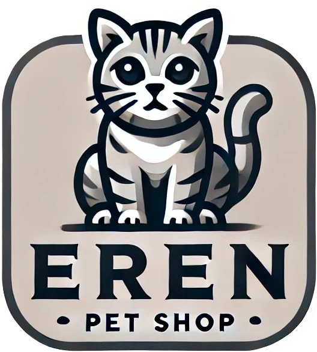

# <span style="display:flex;justify-content: center;align-items: center;gap:15px"> EREN - PetShop</span>

## Descripción

Este proyecto es la segunda preentrega del curso de React de **Coderhouse**: "Navega las rutas". 

El diseño es completamente responsivo gracias al uso de **TailwindCSS**.

## Tecnologías

- **React 18** para una interfaz moderna y dinámica.
- **TailwindCSS** para estilos responsivos y consistentes.
- **Vite** como herramienta de desarrollo rápida y eficiente.

## Instalación

Sigue los siguientes pasos para instalar y ejecutar el proyecto:

1. Clonar el repositorio:
   ```bash
   git clone https://github.com/Jorgedc87/CreaTuLanding1Calder-n.git
   ```

2. Instalar dependencias:
   ```bash
   npm install
   ```

3. Ejecutar la instancia de desarrollo:
   ```bash
   npm run dev
   ```

## Funcionalidades destacadas

- **Filtros dinámicos:** La sección de productos permite filtrar por categoría (Perros o Gatos) y peso en tiempo real.
- **Página de detalles de producto (Item):** Visualiza información detallada de un producto, incluyendo su imagen, descripción, precio actualizado, y un selector de cantidad con diseño responsivo.
- **Footer completo:** Contiene:
  - Logo principal de la tienda.
  - Mapa del sitio para navegación rápida.
  - Logotipos de medios de pago (Mercado Pago, MODO, entre otros) con diseño adaptativo.
- **Página de Error 404:** Una vista estilizada y amigable que informa cuando el usuario accede a una ruta no válida, con un botón para regresar al inicio.
- **Página de envíos:** Información ficticia detallada sobre los métodos de envío, tiempos estimados y costos.
- **Diseño responsivo:** Cada vista y componente están optimizados para dispositivos móviles, tabletas y escritorios, gracias al uso de TailwindCSS.

## Licencia y versión
- **Versión:** 1.1
- **Licencia:** Este proyecto está licenciado bajo la Licencia MIT. Consulta el archivo LICENSE para obtener más información.
- **Autor:** Jorge Calderón